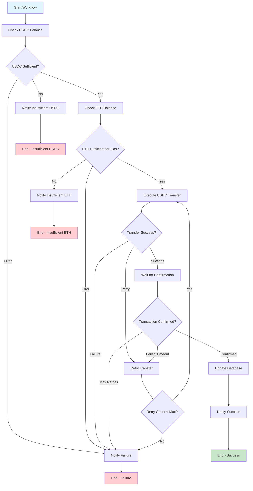

# Rent Payment Workflow Diagram

## Mermaid Flowchart

## Workflow States

### Input State
- `tenantId`: ID of the tenant making payment
- `rentAgreementId`: ID of the rent agreement
- `paymentId`: ID of the payment record
- `amount`: Payment amount in USDC
- `tenantWalletAddress`: Tenant's wallet address
- `ownerWalletAddress`: Owner's wallet address
- `tenantPrivateKey`: Tenant's private key for signing
- `tenantTelegramChatId`: Telegram chat ID for tenant notifications
- `ownerTelegramChatId`: Telegram chat ID for owner notifications

### Intermediate States
- `usdcBalance`: Current USDC balance of tenant
- `ethBalance`: Current ETH balance of tenant
- `estimatedGasCost`: Estimated gas cost for transfer
- `transactionHash`: Blockchain transaction hash
- `transactionReceipt`: Transaction receipt from blockchain
- `retryCount`: Number of retry attempts
- `isTransactionConfirmed`: Whether transaction is confirmed

### Output States
- `workflowCompleted`: Whether workflow has finished
- `workflowSuccess`: Whether workflow completed successfully
- `errorMessage`: Error message if workflow failed

## Decision Points

1. **USDC Balance Check**
   - Sufficient: Proceed to ETH check
   - Insufficient: Send notification and end
   - Error: Send failure notification and end

2. **ETH Balance Check**
   - Sufficient: Proceed to transfer
   - Insufficient: Send notification and end
   - Error: Send failure notification and end

3. **Transfer Execution**
   - Success: Proceed to confirmation
   - Retry: Retry transfer
   - Failure: Send failure notification and end

4. **Transaction Confirmation**
   - Confirmed: Proceed to database update
   - Failed/Timeout: Retry transfer
   - Max Retries: Send failure notification and end

5. **Retry Logic**
   - Retry Count < Max: Retry transfer
   - Retry Count >= Max: Send failure notification and end

## Notifications

### Tenant Notifications
- **Insufficient USDC**: Balance details and shortfall amount
- **Insufficient ETH**: Gas cost details and shortfall amount
- **Retry Attempt**: Current retry count and max retries
- **Payment Success**: Amount and transaction hash
- **Payment Failure**: Reason and retry count

### Owner Notifications
- **Payment Received**: Amount, tenant name, and transaction hash

## Error Handling

### Recoverable Errors
- Network timeouts
- Temporary blockchain issues
- Gas estimation failures

### Non-Recoverable Errors
- Insufficient balances
- Invalid wallet addresses
- Invalid private keys
- Database connection failures

## Retry Strategy

- **Max Retries**: 3 attempts
- **Retry Delay**: 10 seconds between attempts
- **Retry Triggers**: Transfer failures, confirmation timeouts
- **Retry Notifications**: Tenant notified of each retry attempt
